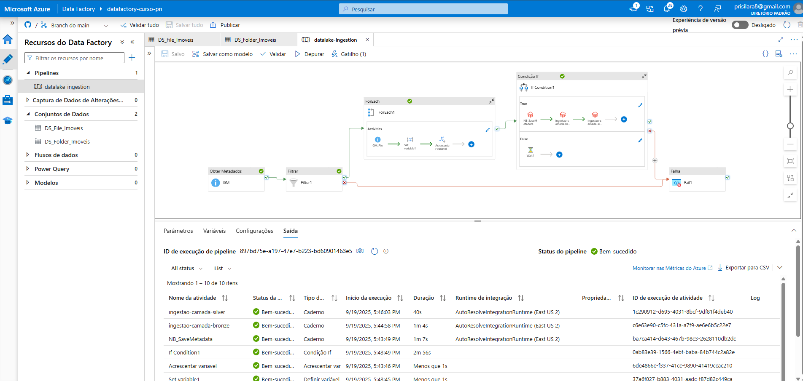
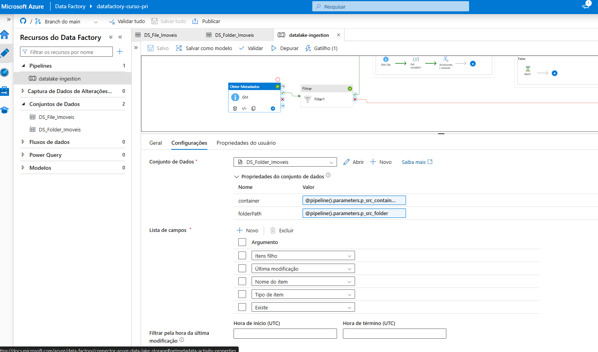
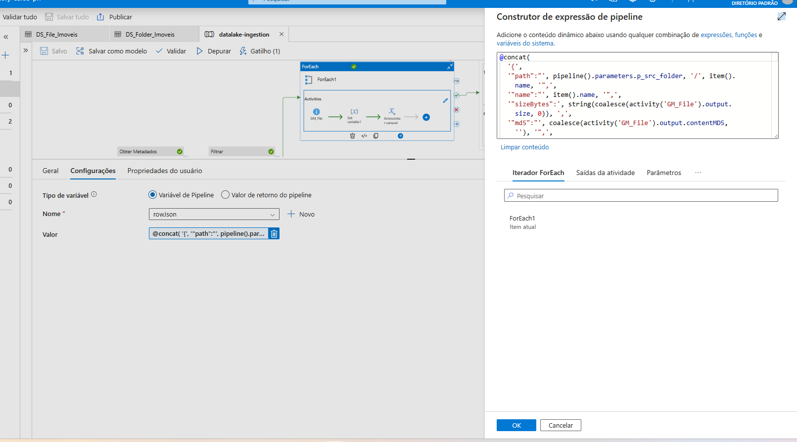

# pipeline-databricks-azure-ADF

Atividades realizadas -> [](https://trello.com/b/iyqdrYDV/databricks-com-adf)

Neste projeto foi criado um pipeline denominado datalake-ingestion, que faz a extração dos dados brutos da camada landing e a ingestão e transformação nas camadas bronzer e silver. 
Orquestra a varredura de uma pasta no ADLS Gen2, gerar um inventário/metadata dos arquivos encontrados (nome, caminho, tamanho, hash, etc.), e disparar notebooks do Databricks para:
1. Salvar os metadados coletados (auditoria/linhagem),
2. Executar a ingestão Bronze,
3. Executar a padronização Silver,
   somente quando houver arquivos a processar.

A execução usa o AutoResolveIntegrationRuntime (East US 2). O pipeline está parametrizado para ser reutilizável em diferentes contêineres/pastas e permite aplicar uma máscara opcional de nomes de arquivo.

Com isso, garantimos linhagem, idempotência e seletividade, reduzindo custos quando não há dados e padronizando a orquestração para múltiplas origens por simples troca de parâmetros. 




## Parâmetros do pipeline

- p_src_container (string): contêiner de origem no ADLS.
- p_src_folder (string): pasta (caminho) dentro do contêiner.
- p_mask (string, opcional): sufixo/“máscara” para filtrar arquivos (ex.: .csv, _2025-09-*.json).
  Se vazio, não aplica filtro por nome.

Esses parâmetros são usados pelos datasets e pelas expressões das atividades.

## Variáveis do pipeline

- filesMetadata (array): recebe, acumulado, um JSON por arquivo.
- rowJson (string): string JSON temporária montada para cada arquivo, depois “appendada” em filesMetadata.
Observação: filesMetadata deve ser inicializada como array vazio ([]).

## Datasets (Conjuntos de Dados)
1. DS_Folder_Imoveis (pasta)
Usado pela atividade Get Metadata “GM” para listar a pasta.
  
Propriedades parametrizadas:
  - container = `@pipeline().parameters.p_src_container`
  - folderPath = `@pipeline().parameters.p_src_folder`

Campos lidos (lista de campos):
  - Tipicamente marcar Items filho (childItems), Existe (exists), Tipo do item, Última modificação (nos seus prints, o essencial é childItems).
    




2. DS_File_Imoveis (arquivo)
Usado pela Get Metadata “GM_File” dentro do ForEach, para cada arquivo.

Propriedades parametrizadas:

- container = `@pipeline().parameters.p_src_container`
- folderPath = `@pipeline().parameters.p_src_folder`
- filename = `@item().name`

Campos lidos (lista de campos):
- Tamanho (size), Última modificação (lastModified), MD5 de Conteúdo (contentMD5) (os seus prints mostram tamanho e md5 habilitados).

## Fluxo de atividades (passo a passo)
(A) Get Metadata — “GM” (sobre a pasta)
Lê childItems da pasta em DS_Folder_Imoveis.
- Por quê? Para obter a lista de itens (arquivos/subpastas) que será filtrada/adiante iterada.

(B) Filter — “Filter1” (filtra apenas arquivos e aplica máscara)
Items:
```Kotlin
@coalesce(activity('GM').output.childItems, json('[]'))
```
Garante array vazio quando não houver `childItems`.
Condição: 
```python
@and(
  equals(item().type, 'File'),
  or(
    empty(string(coalesce(pipeline().parameters.p_mask, ''))),
    endsWith(
      tolower(trim(string(coalesce(item().name, '')))),
      tolower(trim(string(coalesce(pipeline().parameters.p_mask, ''))))
    )
  )
)
```
- O que faz: Mantém somente itens do tipo “File”.
- Se p_mask estiver vazio, passa todos os arquivos.
- Se p_mask tiver valor, exige endsWith(name, p_mask) (case-insensitive, com trim()/tolower()).
- Por quê?
    Evitar subpastas nesta etapa.
    Permitir seleção por padrão (ex.: só “.csv”), sem mudar o pipeline.
  
(C) ForEach — itera sobre os arquivos filtrados 
Sequential = true (garante ordem determinística)
Items:
```kotlin
@coalesce(activity('Filter1').output.Value, json('[]'))
```
Mesmo racional de proteção contra nulos.
Dentro do ForEach:

(C1) Get Metadata — “GM_File” (sobre cada arquivo)

Usa `DS_File_Imoveis` com `filename = @item().name.`
Coleta size, lastModified, contentMD5.
- Por quê? Para compor o “inventário” e possibilitar verificação de integridade (MD5) e idempotência.

(C2) Set variable — “rowJson” 
Monta uma linha JSON com os dados do arquivo. Exemplo (a partir do seu concat):
```kotlin
@concat(
  '{',
   '"path":"', pipeline().parameters.p_src_folder, '/', item().name, '",',
   '"name":"', item().name, '",',
   '"sizeBytes":"', string(coalesce(activity('GM_File').output.size, 0)), '",',
   '"md5":"', coalesce(activity('GM_File').output.contentMD5, ''), '"',
  '}'
)
```
- Por quê? Criar uma representação portátil (string JSON) para cada arquivo.

(C3) Append variable — “filesMetadata” (print 8)
Valor:
```kotlin
@variables('rowJson')
```
- Por quê? Acumular todas as linhas em um array que será entregue ao notebook de auditoria/ingestão.

(D) If Condition — decide se roda os notebooks

Expressão:
```kotlin
@greater(length(coalesce(activity('Filter1').output.Value, json('[]'))), 0)
```
- True: executa três atividades (em série):

1. NB_SaveMetadata (Databricks Notebook) — salva o inventário/linhagem,
2. ingestao-camada-bronze (Notebook),
3. ingestao-camada-silver (Notebook).
- False: executa Wait1 (no-op), evitando custos/erros quando não há arquivos.
- Por quê? Evitar rodar notebooks quando não há dados a processar.

(E) Databricks Notebook — “NB_SaveMetadata”
Caminho: `/Users/pris.../pipeline-...` (notebook de salvamento).
Parâmetros passados:
- `files_metadata_json = @string(variables('filesMetadata'))`
- `container = @pipeline().parameters.p_src_container`
- `folder = @pipeline().parameters.p_src_folder`
- `account = datalakepriscylla`
- Por quê? Persistir os metadados (auditoria, catálogo técnico, downstream em Delta/Parquet, etc.).
Em seguida, os notebooks ingestao-camada-bronze e ingestao-camada-silver são chamados com parâmetros/credenciais do ambiente (conforme setup). A execução no histórico mostra ambos como Bem-sucedido.

(F) Tratamento de falha
Há um bloco Fail1 conectado ao caminho de erro (ícone vermelho no canvas) para sinalizar falhas do ramo principal.

## Runtime e execução
- Runtime: `AutoResolveIntegrationRuntime (East US 2)` 
Execução de exemplo: pipeline concluído Bem-sucedido; notebooks bronze (~1m 44s), silver (~40s), NB_SaveMetadata (~1m 7s).

## Razões de design (por que cada decisão)
1. Parametrização (container/folder/mask) → Reutilização do pipeline em múltiplas origens, com ou sem filtro por extensão/sufixo.
2. Get Metadata (pasta) → Filter → ForEach → Padrão leve para listar/filtrar e iterar apenas o que interessa (arquivos).
3. Coalesce/guards (json('[]')) → Evita falhas em casos sem retorno (pasta vazia/sem permissão).
4. Máscara case-insensitive → Consistência de filtro entre origens heterogêneas (Windows/Linux).
5. Get Metadata (arquivo) → Traz tamanho, md5, lastModified, permitindo:
- Auditoria/linhagem,
- Detecção de duplicidades, idempotência e verificação de integridade.
6. Montagem de JSON e Append → Interface simples entre ADF e notebooks (string JSON ⇒ parse no Databricks).
7. If Condition → Evita custo de cluster/execução quando não há arquivos.
8. Encadeamento Bronze→Silver → Mantém o contrato Medallion e a ordem correta de dependências.
9. Fail node → Terminação clara de erro para alertas/observabilidade.

## Boas práticas e próximos passos
1. Observabilidade:
- Gravar o retorno dos notebooks (runId, status) em uma tabela de auditoria;
- Acionar Alertas no Azure Monitor/Log Analytics em caso de falha.

2. Idempotência/Watermark:
- Usar `lastModified`/`size`/`md5` como chave natural para evitar reprocessar iguais;
- Se desejar, filtrar por janela temporal diretamente na `Get Metadata` (hora de início/fim).

3. Robustez:
- Adicionar Retry nas atividades críticas;
- Tratar exceções específicas no `NB_SaveMetadata` (parse do JSON, schema).

4. Governança:
- Persistir metadata em Delta (catálogo Unity) e documentar no Purview.

5. Parâmetros extras:
- Tornar o caminho do notebook e o workspace parametrizados;
- Adicionar `p_target_catalog/schema/table` para os jobs Bronze/Silver.

